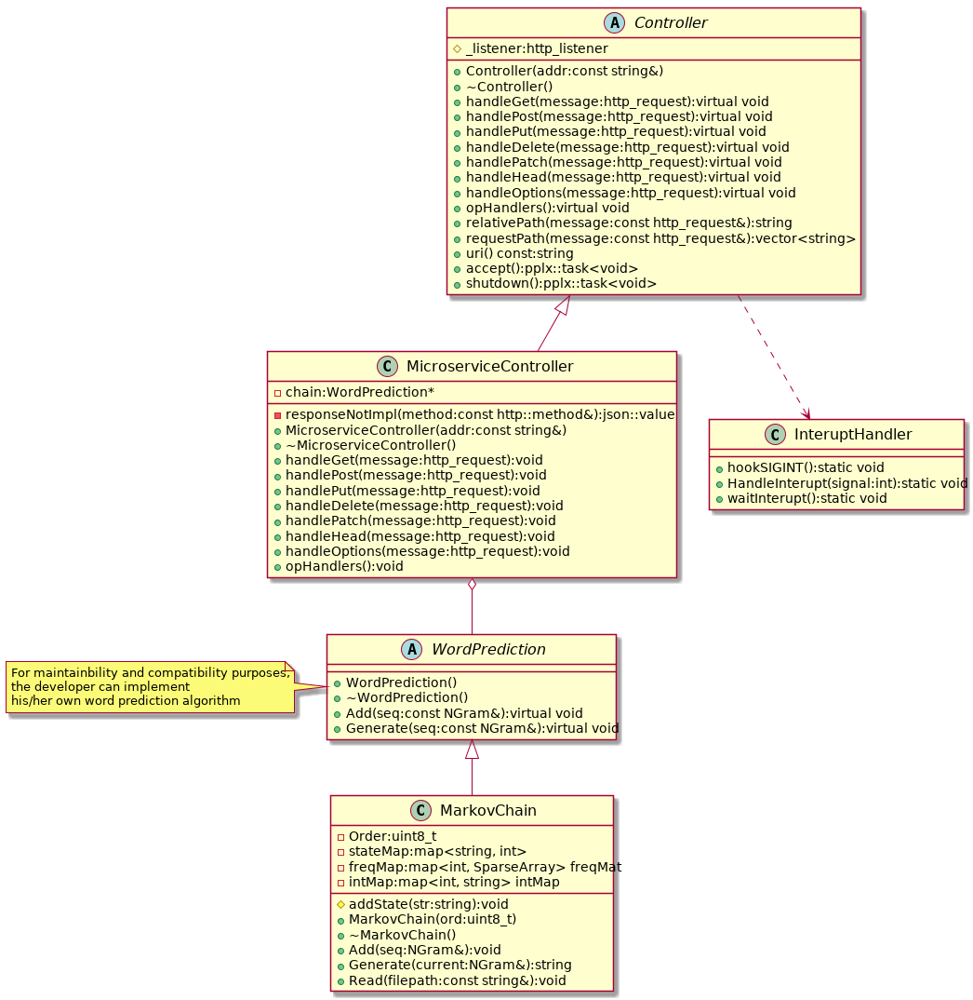

# Markov Chain Playground

## Overview

*Markov Chain Playground* is for experimenting markov chain. It is a web-based application where the
use will be able to train a model a predict words. And the user will also be able to generate
random text.

## Supported Platforms

- GNU/Linux
- MacOS
- Windows (experimental)

## Dependencies

- C++ compatible compiler (gcc/clang)
- make
- cmake
- Boost
- cpprestsdk

## Build

### Debug

```
$ mkdir build
$ cd build
$ cmake -DCMAKE_BUILD_TYPE=Debug ..
$ make
```

### Release

```
$ mkdir build
$ cd build
$ cmake -DCMAKE_BUILD_TYPE=Release ..
$ make
```

## Run

```
$ ./build/markovplay <input file>
Listening on http://127.0.0.1:34568/
Waiting for incoming connections...
```

## Class diagram


